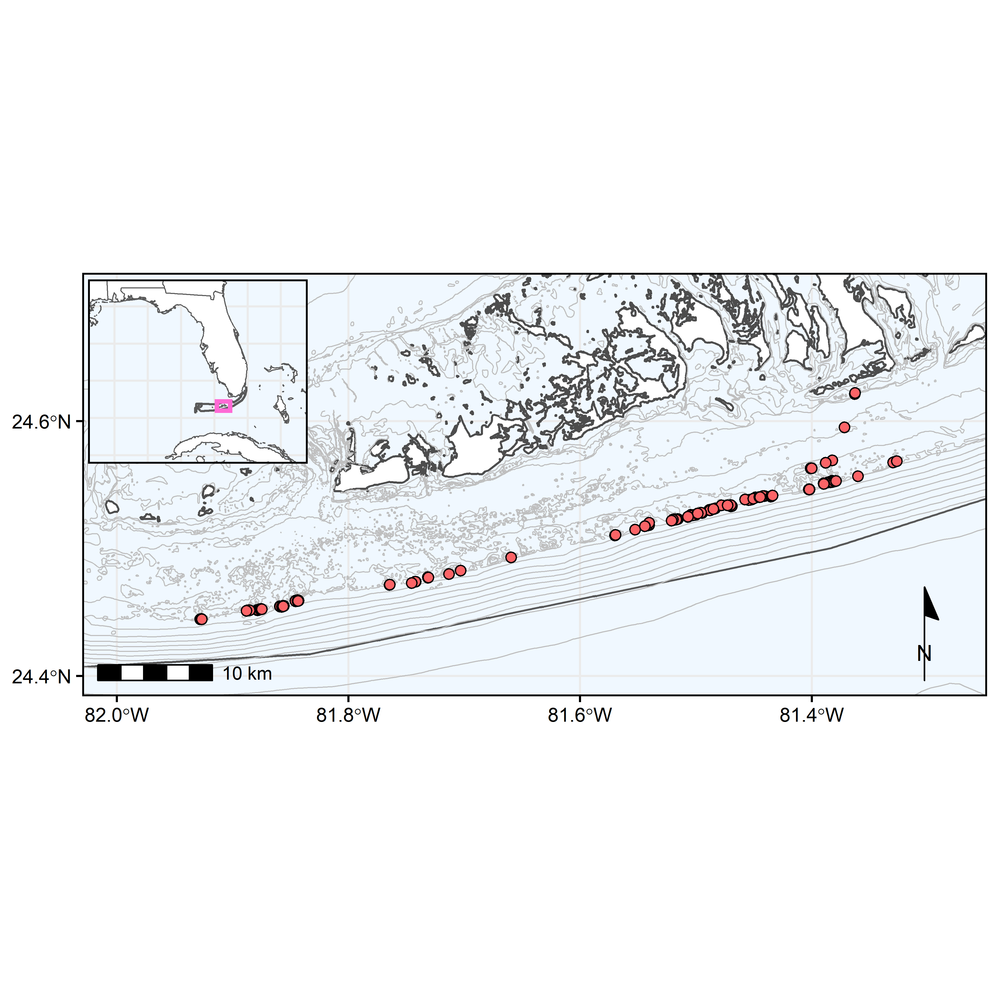

#### version: `r library(magrittr)` `r Sys.Date() %>% format(format="%B %d, %Y")`

#### [GitHub repository](https://github.com/icombs2017/coralMonitoringManuscript="_blank"}

# About this document
***
#### All analyses preformed with R version `r getRversion()`.


# Basic setup of R environment
***

```{r, setup, include = FALSE}
#setup rmarkdown environment first
knitr::opts_chunk$set(warning = FALSE, fig.align = 'left')
knitr::opts_knit$set(root.dir = '../data')
options(width = 88)
```

## Loading required packages
For the following analyses we will require the use of a number of different R packages. We can use the following code to quickly load in the packages and install any packages not previously installed in the R console.

```{r, load packages, include = TRUE, message = FALSE, warning = FALSE, results = 'hide'}
setwd("../data")

if (!require("pacman")) install.packages("pacman")
pacman::p_load("cowplot", "flextable", "ggrepel", "ggspatial", "lubridate", "officer", "paletteer", "patchwork", "rgdal", "rnaturalearth", "sf", "tidyverse", "gdata", "rgeos", "ggpubr", "readxl")
pacman::p_load_gh("eliocamp/ggnewscale")
pacman::p_load_gh("ropensci/rnaturalearthhires")
```
<br>

# Here we are loading the Lat/Long data in from our Metadata spreadsheet as well as loading in layers from our shapefiles in our data folder. We are changing the Lat/Long data (`sites$Lat_Y` and `sites$Long_X`) from a character class to a numeric class. 

<br>

```{r, map data}
sites = read_excel("../data/outplantMetadata.xlsx")
sites$General_Location <- as.factor(sites$General_Location)
sites$Site_ID <- as.factor(sites$Site_ID)
sites$Lat_Y <- as.numeric(sites$Lat_Y)
sites$Long_X <- as.numeric(sites$Long_X)


fknmsBounds <- read_sf("../data/shp/FKNMS_Boundary/FKNMS_Boundary.shp") %>% st_transform(crs = 4326)
flKeys <- read_sf("../data/shp/flKeys.shp") %>% st_transform(crs = 4326)
states = st_as_sf(ne_states(country = c("United States of America")), scale = "large")
countries = st_as_sf(ne_countries(country = c("Cuba", "Mexico", "The Bahamas"), scale = "large"))
florida = read_sf("../data/shp/flKeys.shp") %>% st_transform(crs = 4326)
bathy = read_sf("../data/shp/flBathy.shp") %>% st_transform(crs = 4326) %>% subset(subset = DATASET %in% c("fl_shelf", "fl_coast"))
tortugasBathy = read_sf("../data/shp/tortugasBathy.shp") %>% st_transform(crs = 4326)

```
<br>

Next we build a hi-res polygon of FL with the outplant sites marked. We use `ggspatial` to add a north arrow and scale bar to the main map. 

```{r, maps}
flPal = paletteer_d("vapoRwave::jazzCup")[c(2:5)]
boundPal = c("gray30", paletteer_d("vapoRwave::vapoRwave")[10])

floridaMap = ggplot() +
  geom_sf(data = states, fill = "white", size = 0.25) +
  geom_sf(data = countries, fill = "white", size = 0.25) +
  geom_sf(data = fknmsBounds, alpha = 0.1) +
  geom_rect(aes(xmin = -81.8557, xmax = -81.0535, ymin = 24.4, ymax =24.8947), color = paletteer_d("vapoRwave::vapoRwave")[6], fill = NA, size = 1) +
  coord_sf(xlim = c(-89, -77), ylim = c(22, 31)) +
  theme_bw() +
  theme(legend.title = element_text(size = 9, face = "bold"),
        axis.ticks = element_blank(),
        axis.text = element_blank(),
        axis.title = element_blank(),
        panel.background = element_rect(fill = "aliceblue"),
        panel.border = element_rect(color = "black", size = 0.75, fill = NA),
        legend.text = element_text(size = 9),
        legend.position = "none",
        plot.background = element_blank())

mainKeys <- ggplot() +
  geom_sf(data = flKeys$geometry, fill = "white", color = "gray30") +
  geom_sf(data = fknmsBounds, fill = "black", alpha = 0.1) +
  geom_sf(data = bathy$geometry, color = "gray75", size = 0.25) +
  coord_sf(xlim = c(-81.994327, -81.284336), ylim = c(24.399133,  24.701425)) +
  geom_point(data = sites, aes(x = Long_X, y = Lat_Y), shape = 21, color = "black", fill = "#FB6467FF",size = 2) +
  annotation_scale(location = "bl") +
  annotation_north_arrow(location = "br", which_north = "true", style = north_arrow_minimal()) +
  scale_x_continuous(breaks = c(seq(-82, -80, by = .2))) +
  scale_y_continuous(breaks = c(seq(24, 25, by = .2))) +
theme_bw() +
  theme(panel.background = element_rect(fill = "aliceblue"),
        panel.border = element_rect(color = "black", size = 0.75, fill = NA),
        plot.background = element_blank(),
        axis.title = element_blank(),
        axis.ticks = element_line(color = "black"),
        axis.text = element_text(color = "black"),
        legend.position = "bottom",
        legend.direction = "vertical",
        legend.box = "horizontal",
        legend.title = element_blank())+
  rremove('legend')
  

outplantMap = ggdraw() +
  draw_plot(mainKeys) +
  draw_plot(floridaMap, x = .07, y = .5, width = 0.25, height = 0.25) 
  
ggsave("../figures/figure1.png", plot = outplantMap, width = 16, height = 16, units = "cm", dpi = 600)


```

<br>
